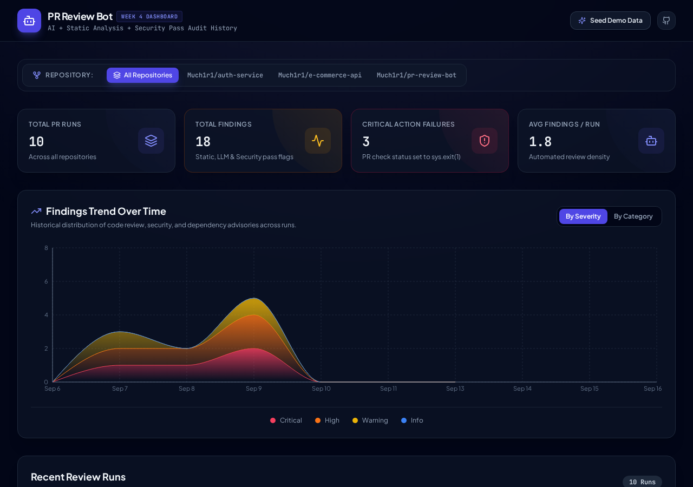
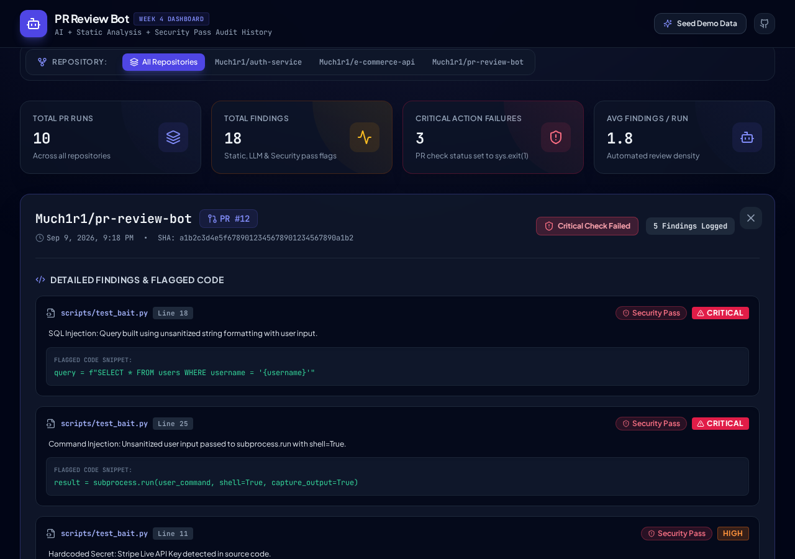

# PR Review Bot

An AI-augmented code review, security scanner, and dependency vulnerability analyzer that runs automatically on pull requests via GitHub Actions. Combines static analysis, dedicated security pattern scanning, OSV dependency vulnerability checks, and LLM-generated, RAG-informed review feedback to catch bugs, security vulnerabilities, and code quality issues before merge—persisting findings to a Convex backend for repo-wide trend analysis in a React dashboard.

## Status

- ✅ **Static Analysis Pipeline**: Diff parsing, line mapping, rule-based checks (hardcoded secrets, debug prints, TODO/FIXME), inline + summary PR comments
- ✅ **LLM Review Layer & RAG Integration**: Groq (Llama 3.3 70B) generates structured, context-aware feedback informed by tree-sitter AST chunking and FAISS vector retrieval of repo context
- ✅ **Security Analysis Pass**: Dedicated AST/regex security pattern pass for OWASP Top 10 vulnerabilities (SQL injection, XSS, SSRF, command injection, path traversal, insecure cryptography, deserialization, broken access control)
- ✅ **Dependency Check**: OSV (Open Source Vulnerabilities) API integration checking added/modified package manifest dependencies against known security advisories
- ✅ **Reusable GitHub Action**: Packaged reusable composite Action (`Much1r1/pr-review-bot@v1`) for easy adoption across any repository
- ✅ **Convex Persistence & Dashboard**: Persists review runs, findings, and metrics to Convex; visualizes repo-wide trends, run drill-downs, and severity metrics via a React/Vite dashboard

## How it works

On every PR open or update (`synchronize`), the Action:

1. **Diff Parsing**: Fetches the PR diff and parses added lines with target file line mappings.
2. **Static Analysis**: Runs rule-based pattern checks for secrets, leftover debug statements, and TODO markers.
3. **Dedicated Security Pass**: Scans added/modified code against security patterns and AST rules for common vulnerabilities.
4. **Dependency Check**: Parses changed dependency files (e.g. `requirements.txt`, `package.json`) and queries the OSV API for known vulnerability advisories.
5. **Ephemeral RAG Indexing**: Builds an in-memory FAISS vector index of AST-chunked repo code at the head commit to provide structural context.
6. **LLM Review**: Retrieves contextually relevant code chunks for changed files and generates structured code review feedback via Llama 3.3 70B.
7. **PR Commenting & Check Status**: Posts inline review comments on specific diff lines and submits a high-level summary review; updates GitHub Check Status.
8. **Findings Persistence**: Saves run metrics and findings to Convex backend database for historical tracking.

## Usage

You can easily integrate PR Review Bot into any GitHub repository using the reusable Action.

### Example Workflow (`.github/workflows/pr-review.yml`)

```yaml
name: PR Review Bot

on:
  pull_request:
    types: [opened, synchronize, reopened]

permissions:
  contents: read
  pull-requests: write

jobs:
  review:
    runs-on: ubuntu-latest
    steps:
      - name: Run PR Review Bot
        uses: Much1r1/pr-review-bot@v1
        with:
          groq-api-key: ${{ secrets.GROQ_API_KEY }}
          github-token: ${{ secrets.GITHUB_TOKEN }} # Optional, defaults to github.token
          convex-url: ${{ secrets.CONVEX_URL }}       # Optional, for findings persistence
          convex-deploy-key: ${{ secrets.CONVEX_DEPLOY_KEY }} # Optional
```

### Important Note on Permissions

The workflow MUST include the explicit `permissions` block:

```yaml
permissions:
  contents: read
  pull-requests: write
```

> **Why?** The default `GITHUB_TOKEN` provided in GitHub Actions workflows is read-only in many enterprise setups and repository defaults. Explicitly requesting `pull-requests: write` permission is required for the bot to post inline comments and summary reviews on pull requests.

## Dashboard

PR Review Bot includes a React + Vite dashboard powered by Convex for real-time visualization of review runs, severity distributions, and findings trends across repositories.

### Overview & Findings Trend


### Run Findings Drill-down


## Architecture

```
src/
  code_chunker.py     # Tree-sitter AST-aware multi-language code chunker
  convex_client.py    # Persists review runs and findings to Convex database
  dependency_check.py # Dependency manifest parser and OSV vulnerability API integration
  diff_parser.py      # Parses unified diff patches into structured added-line data
  github_client.py    # GitHub REST API client: fetches PR diffs, posts inline/summary comments
  llm_review.py       # RAG-augmented LLM review calls (Groq Llama 3.3 70B), prompt construction
  main.py             # Main entry point orchestrating static, security, dependency, and LLM checks
  rag_index.py        # Ephemeral RAG indexer (sentence-transformers embedding + FAISS vector store)
  rules.py            # Rule-based static checks (secrets, debug statements, TODO/FIXME)
  security_review.py  # Security scanner for OWASP Top 10 vulnerability patterns

dashboard/            # React + Vite + Tailwind CSS + Lucide + Recharts web dashboard
  src/
    components/       # Metric cards, trend charts, run tables, finding detail modals
    App.tsx           # Main dashboard UI component
convex/               # Convex database schema, queries, and mutations (runs, findings, trends)
action.yml            # Reusable GitHub Action definition
```

## Setup & Local Development

### Requirements

- Python 3.10+
- Node.js 18+ (for dashboard local development)

### Local CLI Review Execution

```bash
pip install -r requirements.txt

# Run the review suite locally on a PR
export GITHUB_TOKEN="your_github_token"
export GROQ_API_KEY="your_groq_api_key"
export REPO="owner/repo"
export PR_NUMBER=123
export BASE_SHA="base_commit_hash"
export HEAD_SHA="head_commit_hash"

python -m src.main
```

### Running the Dashboard

```bash
cd dashboard
npm install
npm run dev
```

## Design notes

- **RAG scope**: Ephemeral, per-run indexing only—no persisted vector store. Re-indexing per run ensures zero stale context and simplifies infrastructure without requiring a persistent vector database.
- **Retrieval granularity**: Per-file diff retrieval—each changed file's diff is used as the query, retrieving related function/class chunks from the codebase.
- **Chunking**: Multi-language AST-aware chunking via tree-sitter (Python, JS/TS, Go, Rust, Java, C/C++) with structural header metadata (filename, class, signature).
- **Models & Services**: Groq (Llama 3.3 70B) for review generation, local `sentence-transformers` embedding models for FAISS indexing, and OSV API for open-source vulnerability advisory checks.
